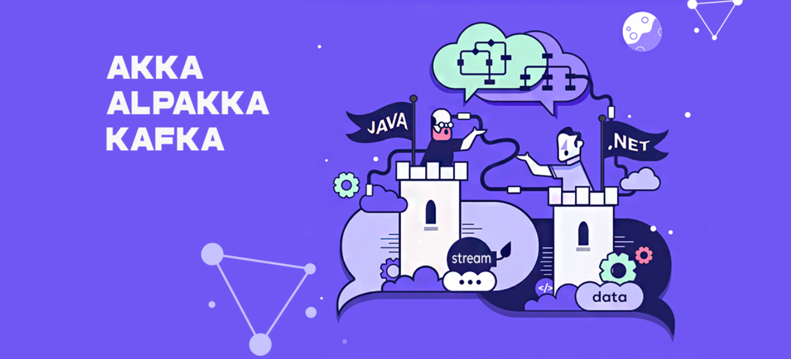

# JAVA-LABS




Spring Boot(java)을 기본으로 주변 오픈스택을 활용하는 활동으로

Akka/Webplux를 포함 다양한 오픈스택(Kafka/Spark Stream)등을  Reactive Streams을 통해 

연속성있는 이벤트를 다루는것을 추가로 연구하고 있습니다.


## 연구컨셉
- NOSQL : SQL을 하지말자는 이야기가 아니며~ SQL문만을 하지않기위해서는 SQL의 기본을 더 익혀야합니다.
- CRUD -> CQRS : CQUD를 모두 대체하자는 이야기가 아닙니다. CRUD의 한계를 이해하고 CQRS를 배웁니다. 그러기 위해서는 CRUD 기본기가 필요합니다.
- Stream : 오늘날의 데이터는 배치처리기로만으로 

## 사용툴

- https://www.jetbrains.com/ko-kr/idea/download


## 도커 빌드/푸시

```
// 도커허브 또는 사설레지스트리 로그인
docker login registry.webnori.com

## lighthouse>

docker build -f Dockerfile --force-rm -t registry.webnori.com/javalabs-lighthouse:dev .

docker push registry.webnori.com/javalabs-lighthouse:dev

## springweb>

// 도커빌드
docker build -f Dockerfile --force-rm -t registry.webnori.com/javalabs-api:dev .

// 도커런 - 푸시전에 잘작동하는지 로컬 테스트
docker run -e SPRING_PROFILES_ACTIVE=dev --publish 8081:8080 --name javalabs-app registry.webnori.com/javalabs-api:dev

// 도커푸시
docker push registry.webnori.com/javalabs-api:dev

```

## Springweb Cluster

```

```


## Doc

- [SpringBoot 셋팅](./springweb/README.md)
- [AKKA](./springweb/src/test/java/com/webnori/springweb/akka/README.md)
- [Webflux](./springweb/src/test/java/com/webnori/springweb/webflux/README.md)
- [AkkaLabs](https://wiki.webnori.com/display/AKKA/AKKA+Labs)
- [OpenStack](./infra/README.md)


## 참고사이트

이벤트를 유체처럼 다뤄야한다는 컨셉인 리액티브 스트림의 원조는 rx.net(Reactive X) 부터 기원을 찾을수 있으며~
NetFlix rx.java버전을 만들어 크게 성공을 하면서 더욱더 알려지기 시작하였습니다.

다른 진영의 유사스펙(동시성/병렬처리/스트림처리) 컨셉을 함께 알아가는것은 자신의 진영에서도 도움이 되며
오늘날의 각 진영의 언어는 서로 상호영향을 주면서 발전해 가고 있습니다.
여기서 작성된 개념과 컨셉은 다른 언어로도 구현을 시도하고 있으며, 함께 연구합니다.

- [NetCore With Reactive Stream](https://github.com/psmon/NetCoreLabs)
- [Reactive X](https://reactivex.io/)