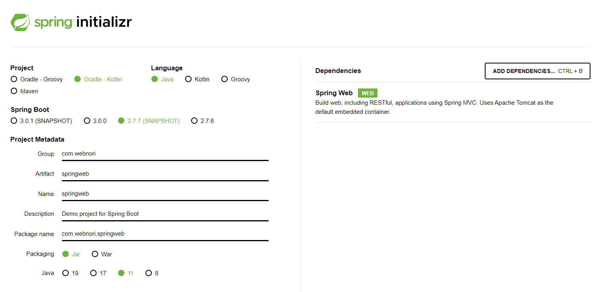
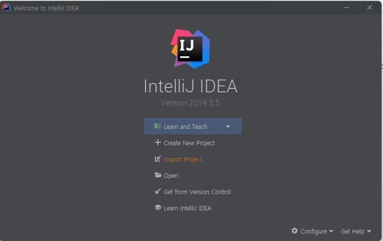
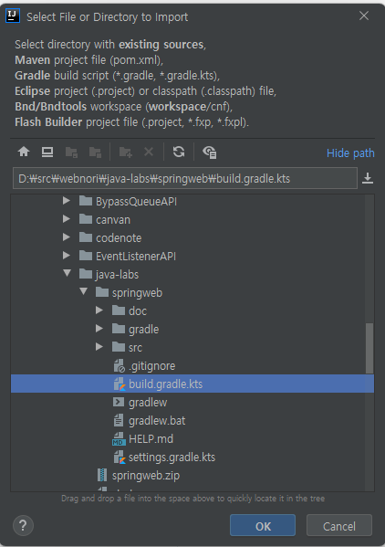
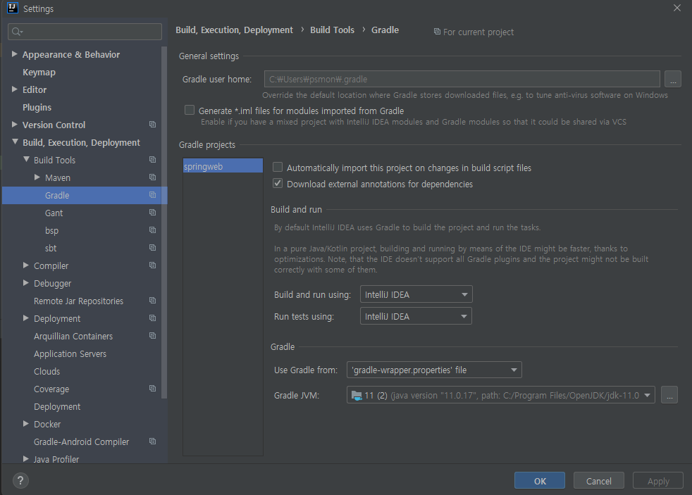

# Getting Started

### Spring Boot Starter

이 프로젝트의 시작 템플릿

- https://start.spring.io/

### Import

최초 로컬환경에서 프로젝트 로드하기

#### Step1 - Import Project 

#### Step2 - Gradle File 선택하기

#### Step3 - Gradle Build 환경 개인화

    //gradle-wapper.properties 
    //Spring 2.7.7을 호환하는 Gradle 버전으로 수정진행됨
    distributionUrl=https\://services.gradle.org/distributions/gradle-6.8.3-bin.zip

### OpenJDK 11
- https://www.openlogic.com/openjdk-downloads?field_java_parent_version_target_id=406&field_operating_system_target_id=436&field_architecture_target_id=391&field_java_package_target_id=396

### 빌드/실행하기

      .   ____          _            __ _ _
     /\\ / ___'_ __ _ _(_)_ __  __ _ \ \ \ \
    ( ( )\___ | '_ | '_| | '_ \/ _` | \ \ \ \
     \\/  ___)| |_)| | | | | || (_| |  ) ) ) )
      '  |____| .__|_| |_|_| |_\__, | / / / /
     =========|_|==============|___/=/_/_/_/
     :: Spring Boot ::       (v2.7.7-SNAPSHOT)

- IDE의 Build/RUN을 통해서실행
- Gradle TAB의 GRADLE TASK를 통해서도 수행가능

### 연습과제

이 저장소를 빌드/실행 성공하였으면 다음을 수행

- https://start.spring.io 에서 자신의 Group ID로 (com.yourname) 어플리케이션 생성
- GreetingController 참고해서 , /greeting2 API 작성해보기 

###

- 실행 : http://localhost:8080/swagger-ui/index.html

### Reference Documentation
For further reference, please consider the following sections:

* [Official Gradle documentation](https://docs.gradle.org)
* [Spring Boot Gradle Plugin Reference Guide](https://docs.spring.io/spring-boot/docs/2.7.7-SNAPSHOT/gradle-plugin/reference/html/)
* [Create an OCI image](https://docs.spring.io/spring-boot/docs/2.7.7-SNAPSHOT/gradle-plugin/reference/html/#build-image)
* [Spring Web](https://docs.spring.io/spring-boot/docs/2.7.7-SNAPSHOT/reference/htmlsingle/#web)

### Guides
The following guides illustrate how to use some features concretely:

* [Building a RESTful Web Service](https://spring.io/guides/gs/rest-service/)
* [Serving Web Content with Spring MVC](https://spring.io/guides/gs/serving-web-content/)
* [Building REST services with Spring](https://spring.io/guides/tutorials/rest/)

### Additional Links
These additional references should also help you:

* [Gradle Build Scans – insights for your project's build](https://scans.gradle.com#gradle)

