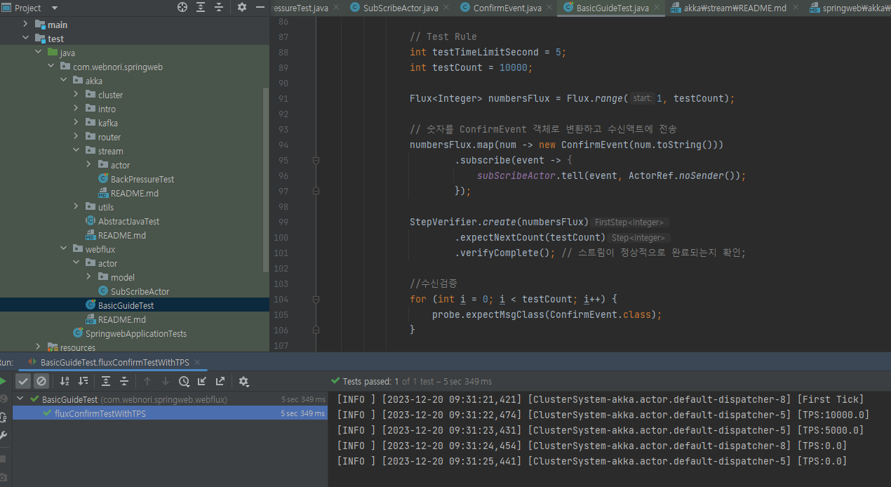

# Webflux with AkkaStream

WebFlux를 AkkaStream에 연동하는 변종실험입니다.

서로다른 구현체인 WebFlux와 AkkaStream이 연결되는지를 확인하는것 자체는

ReactiveStream을 준수하는 객체가 상호간 연결이 가능한지를 검증해보는 테스트 활동이며

프레임워크 내에서의 StreamAPI는 일반적으로 한가지만 채택하는것을 권장합니다.

## Webflux

WebFlux는 Spring Framework 5에서 도입된 리액티브 프로그래밍을 위한 웹 프레임워크입니다.
이는 전통적인 Spring MVC와 다르게 비동기 및 논블로킹 방식을 지원하여,
리액티브 스트림스(Reactive Streams) 기반으로 높은 처리량과 효율적인 리소스 사용을 가능하게 합니다.


### Reactive Strems 표준활동

- 배경: Reactive Streams는 비동기 데이터 스트림 처리에 대한 수요가 증가함에 따라 개발되었습니다. 대용량 데이터 처리, 고성능 웹 애플리케이션, 실시간 데이터 스트리밍 등의 분야에서 필요성이 대두되었습니다.
- 개발: 이 표준은 2013년경 Lightbend (당시 Typesafe), Netflix, Pivotal 등 여러 회사와 개발자들이 협력하여 만들었습니다.
- 목적: Reactive Streams의 주된 목적은 대규모 분산 시스템에서의 백프레셔(back-pressure)를 관리하고, 데이터 스트림의 비동기 처리를 표준화하는 것입니다.

Webflux 역시 ReactiveStrems을 준수하고 있으며 AKKA Stream과 연결이 가능합니다.
이러한 프레임워크가 단순하게 동시성처리의 목적만을 가진것이 아닌 ReactiveStreams을 준수하는 오픈스택들과
그 목적과 구현체가 달라도 표준적인 방법으로 연결이 가능하다란것입니다.

AkkaStream과 Webplux가 어떻게 연결이 되고 작동되는지 살펴보겠습니다.

###

도메인영역을 다루는 메인스트림은 단일요소로 활용하는 것이 권장되지만
아래와같이 데이터가 AkkaStream에서 출발하여 Webplux를 지나 Actor모델로 도달할수 있습니다.
이것은 Akka와 Webplux가 상호 연동하려고 맞춘적은 없지만~ ReactiveStream을 준수하였기때문에 가능한 시나리오이며
모든 ReactiveStrem 준수모듈은 동일하게 연결이 가능합니다.


```
                                                                                                                                
                 +--------+   +--------+   +--------+   +--------+                                                              
                 |        |+-+|        +-+-+        |+-+|        |                                                              
                 |        |+-+|        +-+-+        |+-+|        |                                                              
                 |        |   |        |   |        |   |        |                                                              
                 +--------+   +--------+   +--------+   +--------+                                                              
                                                                                                                                
          Sink(AkkaStream) -> Publisher(Reactive) -> Subscribe(Flux) -> Actor 
```

다음 코드는

- AkkaStream의 Backpressure/Throttle를 통과하고 Reactive Stream의 표준인 Publisher로 흘려보냅니다.
- Webplux는 Publish를 수신받아 Subscribe를 처리합니다.
- SubScribe에서는 유닛테스트내에서 TPS측정과 수신검증이 가능한 Actor모델로 흘려보냅니다.

```
// AkkaStream
Publisher<ConfirmEvent> publisher = source
        .via(initialDelayFlow)
        .via(backpressureFlow)
        .throttle(processCouuntPerSec, Duration.ofSeconds(1))
        .via(convertFlow)
        .runWith(Sink.asPublisher(AsPublisher.WITH_FANOUT), materializer);

// Webplux
Flux<ConfirmEvent> flux = Flux.from(publisher);

flux.subscribe(event -> subScribeActor.tell(event, ActorRef.noSender()));

// StepVerifier Junit에서 Webflux검증을 지원합니다.
StepVerifier.create(flux)
        .expectNextCount(testCount)
        .verifyComplete(); // 스트림이 정상적으로 완료되는지 확인;

// 수신검증 by AkkaTest 관찰자
for (int i = 0; i < testCount; i++) {
    probe.expectMsgClass(ConfirmEvent.class);
}
```

StreamAPI와 같이 동시성/병렬처리를 다루는 선언형 프로그래밍을 다루는경우~

문서만을 보고 학습하는것보다~ 유닛테스트를 통해 실제작동하는 코드를 만들고 검증하는 방식이 도움이됩니다.

생산한 메시지수만큼 Flow처리 과정을 거쳐 변환된 데이터가 우리의 의도대로 수신이되었나? 검증하는것은 중요합니다.

여기서 설명된 내용은, 작동가능 코드로 커밋이 되었으며  유닛테스트를 통해 TPS측정및 스트림흐름 수신검증이 가능합니다.



Webplux의 처리 수신 검증툴과 함께 TPS측정기를 탑재하여 Webplux의 Stream 처리도 연구항목으로 최근 추가가 되었으며
다양한 실험을 준비예정입니다.

위 검증코드를 통해 Webflux와 Actor모델을 이용한 수신검증이 초당 1만회이상 수행할수 있음을 알수 있습니다.
스트림처리는 일반적으로 다양한 IO를 다루게되며 속도제어없이 만개를 IO 동시처리 시도하면 IO에서 문제가 발생할수 있습니다.
속도흐름 제어방식을 고민해야하며 이것을 측정하지못하면 개선을 못할뿐더러~ 우리가 작성한 코드의 처리량 자체를 짐작할수 없게됩니다.
ReactiveStream API를 이용하는경우 BackPresure를 다양한 구현방식으로 지원하기때문에 BufferSize 기본값이 무엇이며? 어떻게 작동하고 흐름을 조절할수 있는지? 파악하는것은 중요합니다.


link : https://github.com/psmon/java-labs/blob/master/springweb/src/test/java/com/webnori/springweb/webflux/BasicGuideTest.java


여기서 상세하게 다루지 못한 내용은 다음 아티컬을 통해 주가정보를 획득할수 있습니다.